# Simple MS Graph PHP SDK for sending e-mail using a Shared Mailbox (using "Application permisions" and not using "Delegated permissions")

## Installation (Example on Windows)

1) Download PHP for Windows:
[https://windows.php.net/downloads/releases/](https://windows.php.net/downloads/releases/)

2) Unzip in your Program Files folder:
(Unblock the zip before unzipping. Right Click, "Properties" to unblock)  
`C:\Program Files\php-8-x64\`

3) Add the PHP installation folder into your PATH Environment Variables  
`C:\Program Files\php-8-x64\`  
(The PHP Composer path will be automatically added after PHP Composer installation)


4) Install PHP Composer with Windows Installer:
   [https://getcomposer.org/download/](https://getcomposer.org/download/)  
   It will detect your PHP installation and add the proper Environment Variables for you. If not, you can add as describe on the previous step.  
   (`php.ini` will be generated in your php installation folder after the installation of the PHP Composer)
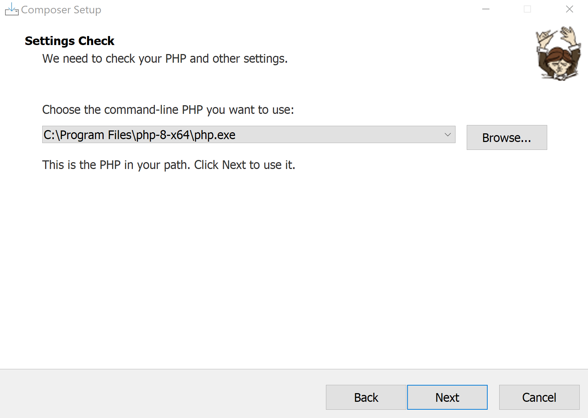

5) Download the `cacert.pem` and save it in your PHP installation folder, ssl folder:
   [https://curl.se/docs/caextract.html](https://curl.se/docs/caextract.html)  
   (Unblock the .pem file: Right Click, "Properties" to unblock)

   `C:\Program Files\php-8-x64\extras\ssl`  

    
    Add the following settings (change acording to your settings) in your php.ini (`C:\Program Files\php-8-x64\php.ini`)  

    ```ini
    curl.cainfo = "C:\Program Files\php-8-x64\extras\ssl\cacert.pem"
    openssl.cafile = "C:\Program Files\php-8-x64\extras\ssl\cacert.pem"
    ```

    

## Post Installation

1) Launch Visual Studio Code, in the terminal, run the following command for installing all dependencies:

    ```pwsh
    cd .\send-email-from-shared-account\
    composer update
    ```

## How to create Azure App Registration

(Need admin rights on Azure AD)

**(Till the end of the README.md file, we will suppose that your Shared Mailbox is named `contact@domain.com`)**

1) Go to the Azure Active Directory portal:
[Azure AD Portal](https://portal.azure.com/#view/Microsoft_AAD_IAM/ActiveDirectoryMenuBlade/~/Overview)

### Create the "Send E-mail from a Shared Mailbox" Application Registration (Application Client ID)

1) Click Add > App registration
2) Name: Send E-mail from a Shared Mailbox (`contact@domain.com`)
3) Supported account types: Accounts in this organizational directory only (TENANT_NAME only - Single tenant)
4) Redirect URI (Optional): Select "Web" platform and keep the input text tempty
5) Click "Register"
6) **After the Application Registration has been created, mark down:**
   1) **Application (client) ID**
   2) **Directory (tenant) ID**
7) Go to the "API Permissions" menu and click "Add a permission"
8) Select "Microsoft Graph"
9) Select "Application permissions"
10) Search for `Mail.Send` and Add that permission  
    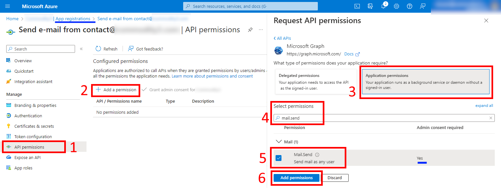
11) After adding this permission, you can "Grant admin consent for TENANT_NAME" otherwise it won't work  
    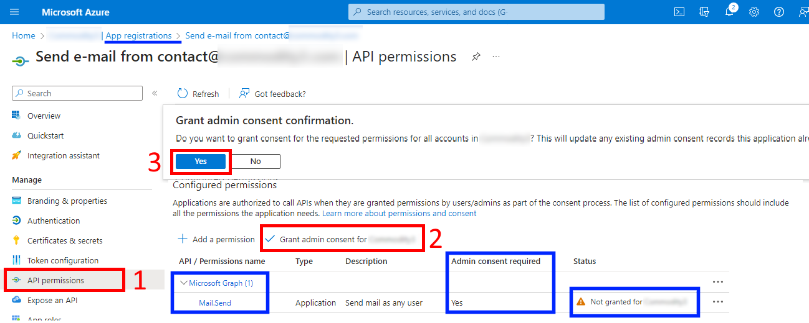
12) You can remove the permission "User.Read"
13) Create the Application Client ID Secret through the (side) menu "Certificates & secrets"
14) Select the tab "Client secrets"
15) Click "New client secret"
16) Add a description like "secret for sending e-mail from shared mailbox"
17) Expires: pick a period and click "Add"  
    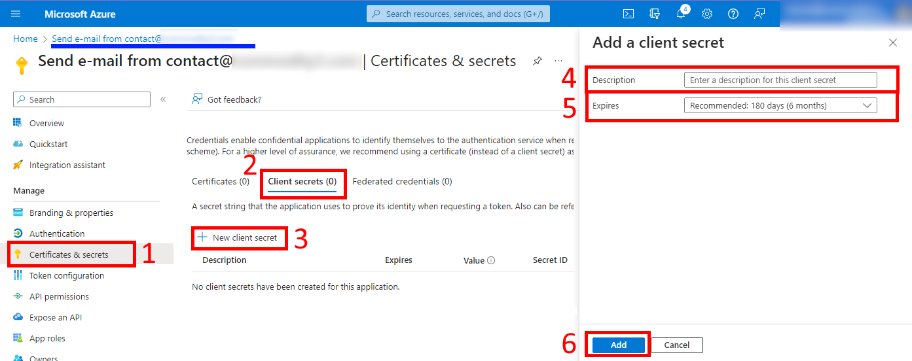
    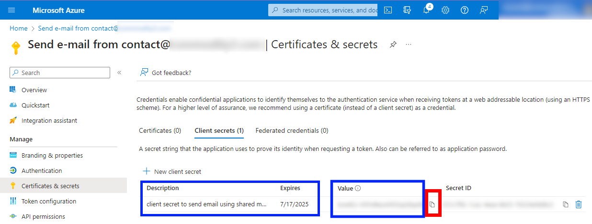
18) Mark down the secret value and add it in the ".env" file

Your app registration has now permission to send e-mail from any mailbox! We can now restrict this to specific shared mailboxes with the following powershell - e.g. my application is restricted to only look at the "`contact@domain.com`" mailboxes.

### Create a Mail-enabled Security Group for restricting the access of your app registration

1) Go to the Exchange Admin Center portal:
    <https://admin.exchange.microsoft.com/#/groups>
2) Go to the tab "Mail-enable security" tab and create a new group like this:
    Example: `restrict_access_contact@domain.com`
3) Add the Shared Mailbox account used for sending e-mails as a member of this Mail-enabled security group.
4) You should also enable the following option: "Hide this group from the global address list" as this security group is dedicated for applying an "Application Access Policy" only


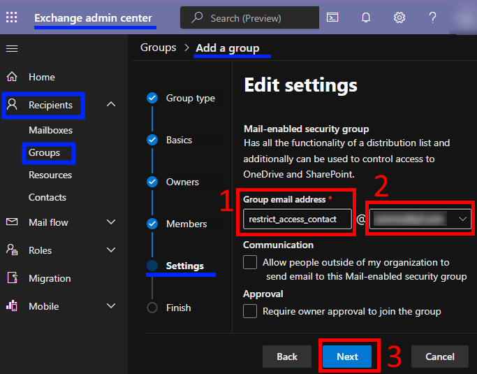
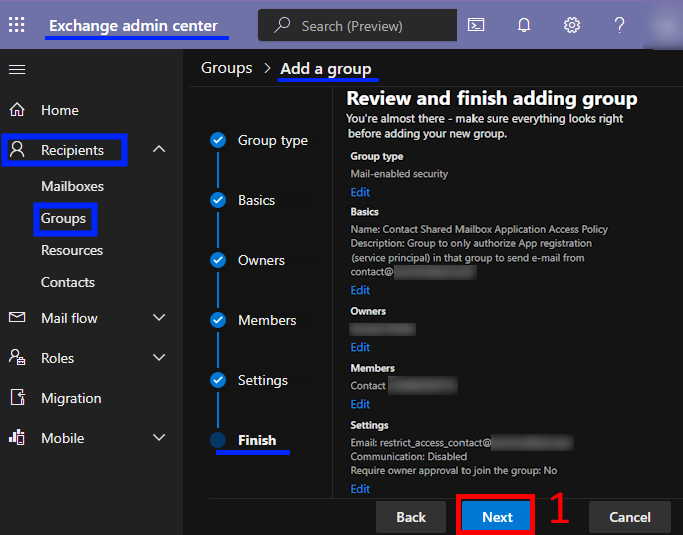

### Install "ExchangeOnlineManagement" (> v3.2.0) Powershell module for creating the Application Access Restriction

1) Launch a Powershell console
2) Run the following command to install the "ExchangeOnlineManagement" Powershell module:

   ```pwsh
   Install-Module -Name ExchangeOnlineManagement -RequiredVersion 3.2.0
   ```

    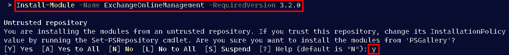

3) Connect to the Exchange Online Management platform using the following Powershell command:

    ```pwsh
    Connect-ExchangeOnline
    ```

    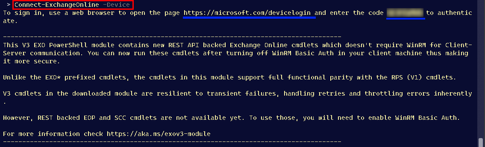

4) Create the Application Access Policy using the Application ID created on the previous step using the following powershell command:

    ```pwsh
    New-ApplicationAccessPolicy -AccessRight RestrictAccess -AppId "xxxxxxxx-xxxx-xxxx-xxxx-xxxxxxxxxxxxxx" -PolicyScopeGroupId "restrict_access_contact@domain.com" -Description "Restrict this app to members of the security group restrict_access_contact@domain.com"

    # (Optional) To check and get the Access Policy ID in case you want to delete with "Remove-ApplicationAccessPolicy -Identity"
    Get-ApplicationAccessPolicy
    ```

    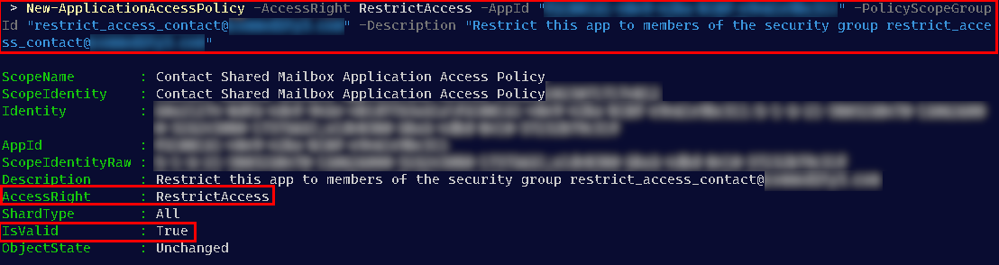

    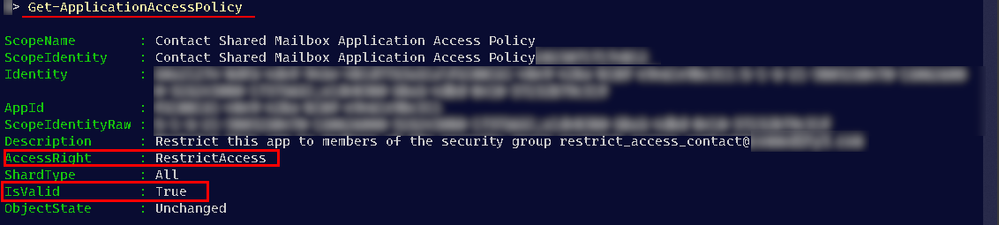

5) Test your Aplication Registration access to send as `contact@domain.com`

    ```pwsh
    # To test connectivity of your app (service principal)
    # Specify the Shared Mailbox account that the App Registration (Service Principal,  "-Identity") should be able to send as
    Test-ApplicationAccessPolicy -Identity "contact@domain.com" -AppId "xxxxxxxx-xxxx-xxxx-xxxx-xxxxxxxxxxxxxx"
    # Test the result with an account without the proper user right 
    Test-ApplicationAccessPolicy -Identity "generic_mailaccount@domain.com" -AppId "xxxxxxxx-xxxx-xxxx-xxxx-xxxxxxxxxxxxxx"
    ```

    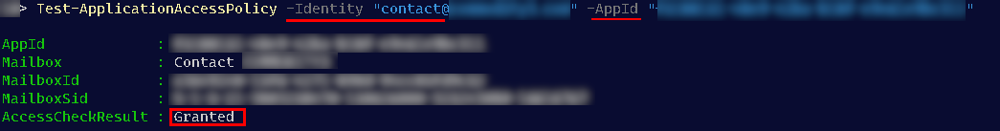
    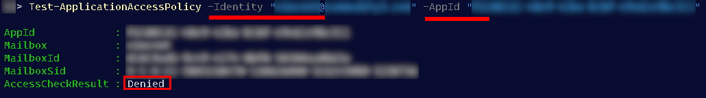

### Send an email using the Shared Mailbox account

1) Fill the file ".env" using the information created during the creation of the Application Registration (Tenant ID, Client ID, Client Secret Value)  
    (Copy / Rename the file .env.example to .env)
2) Fill the variable "SEND_AS_MAILBOX_ADDRESS" from .env with the shared mailbox e-mail address that you would like to use for sending the e-mail.
3) Run the PHP script "send_mail.php"
4) You will see your e-mail sent
